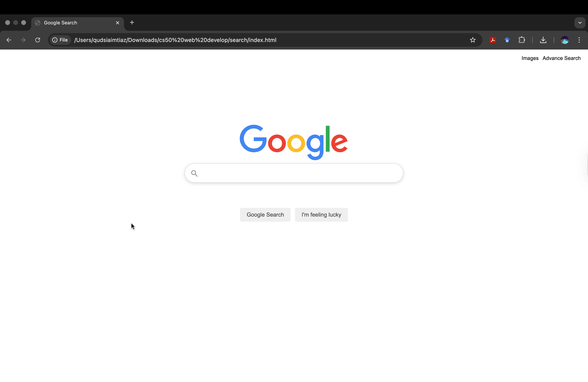
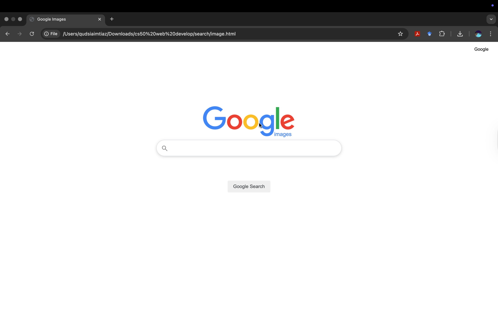
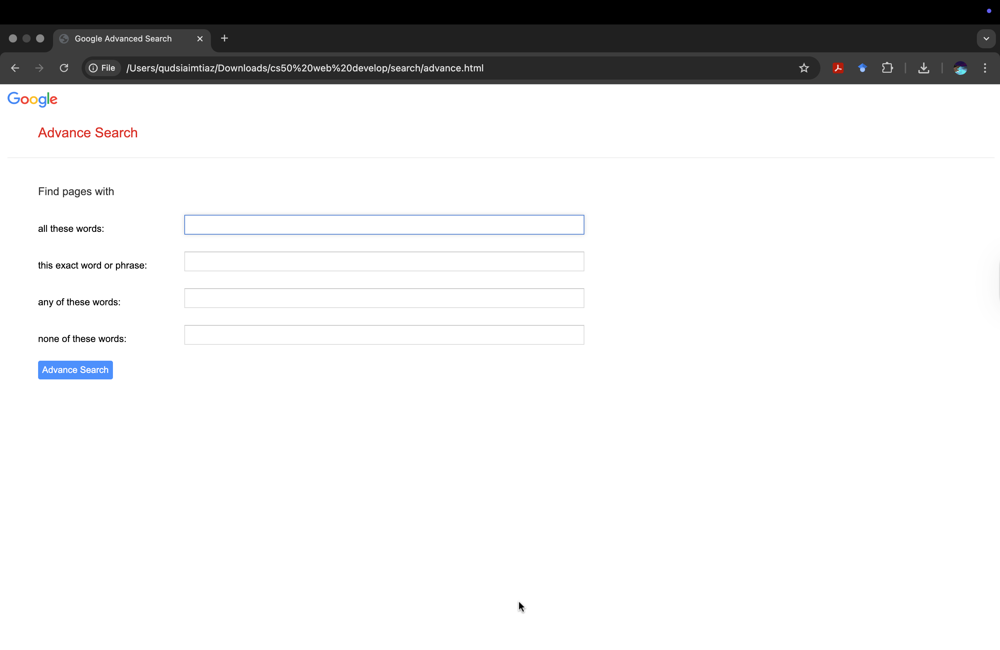

# CS50 Web Project 0: Google Search Clone

This is my first CS50 Web Development project. The goal was to replicate a simplified version of Google’s interface and search functionality.

## Features
- **Google Search** page (`index.html`) with:
  - Centred search bar
  - Google Search button
  - “I’m Feeling Lucky” button
- **Google Image Search** page (`images.html`) with an image search interface
- **Google Advanced Search** page (`advanced.html`) with fields for:
  - All these words
  - This exact word or phrase
  - Any of these words
  - None of these words
- Navigation links between pages for easy switching
- CSS styling mimics Google’s aesthetics
- “I’m Feeling Lucky” button redirects to the first search result

## How to Run
1. Clone the repository:
   ```bash
   git clone https://github.com/codingpro52/cs50-web-google-clone.git

## Credits

- CS50 Web Development course (Harvard)
- Google interface for inspiration

## Screenshots

### Google Search Page


### Google Image Search


### Google Advanced Search

